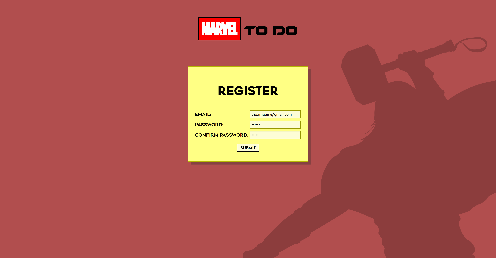
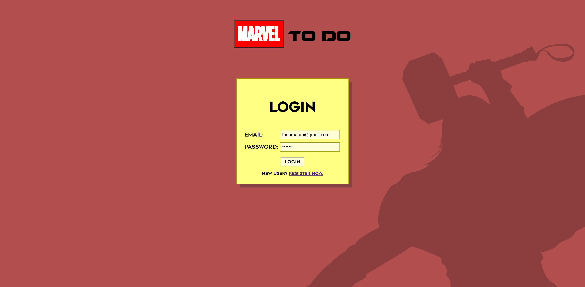
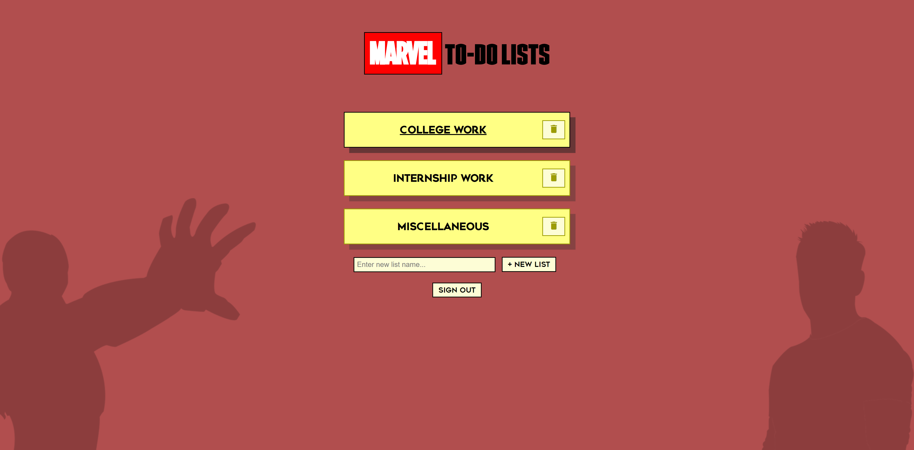
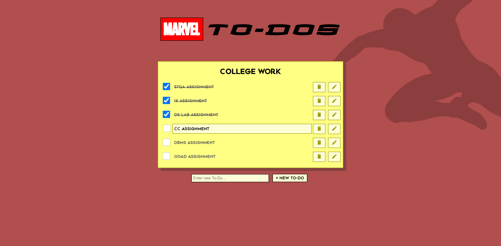

# TODO Web App

ToDo Application to perform the following functions:
<ul>
  <li>Login</li>
  <li>Register</li>
  <li>View all ToDo Lists</li>
  <li>View ToDos in each list</li>
  <li>Mark a ToDo as done</li>
  <li>Delete a ToDo</li>
  <li>Edit a ToDo</li>
</ul>

  &nbsp&nbsp
  &nbsp&nbsp
  

---

  1)Register
   

   2)Login
   

  3)ToDo Lists
   

  4)ToDos
   

